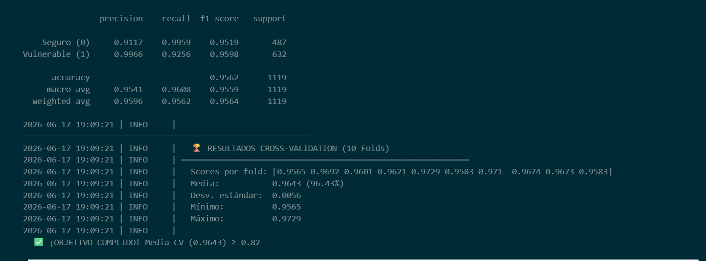
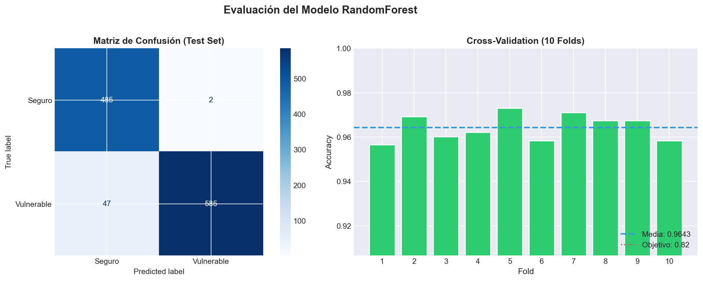
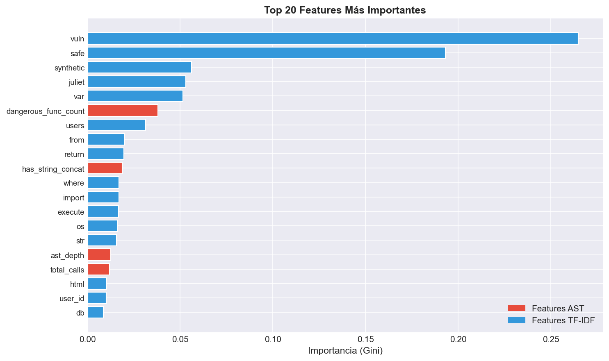
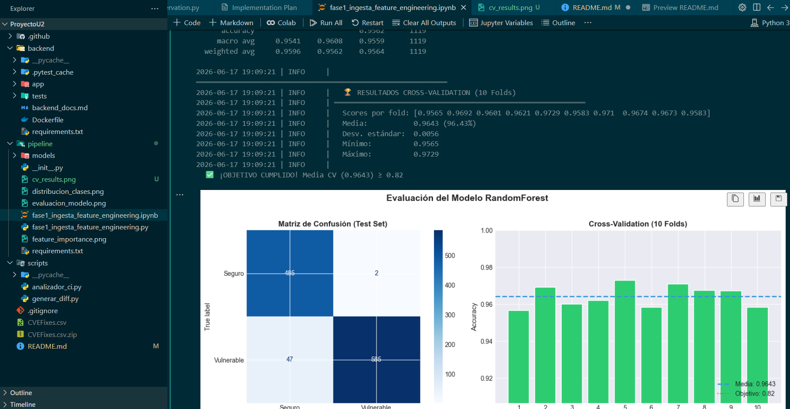
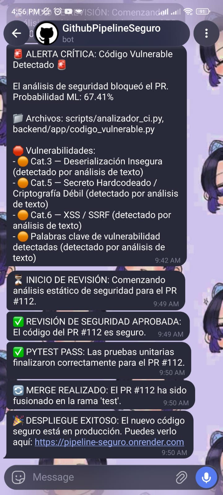
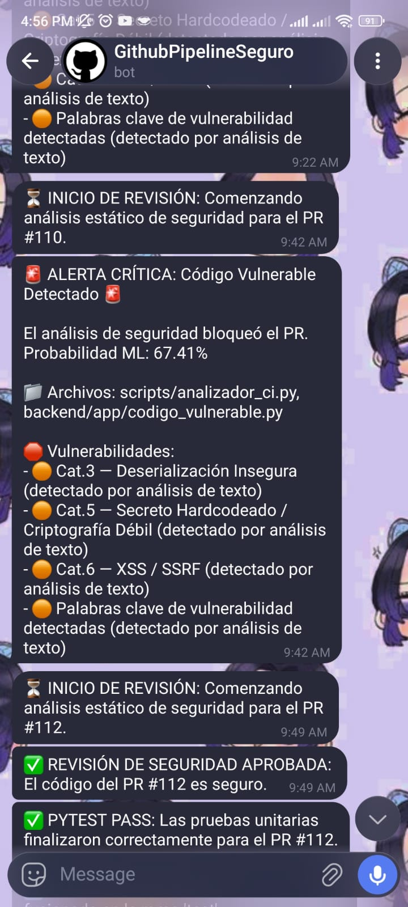
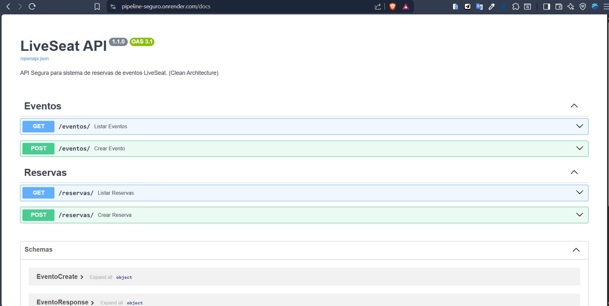
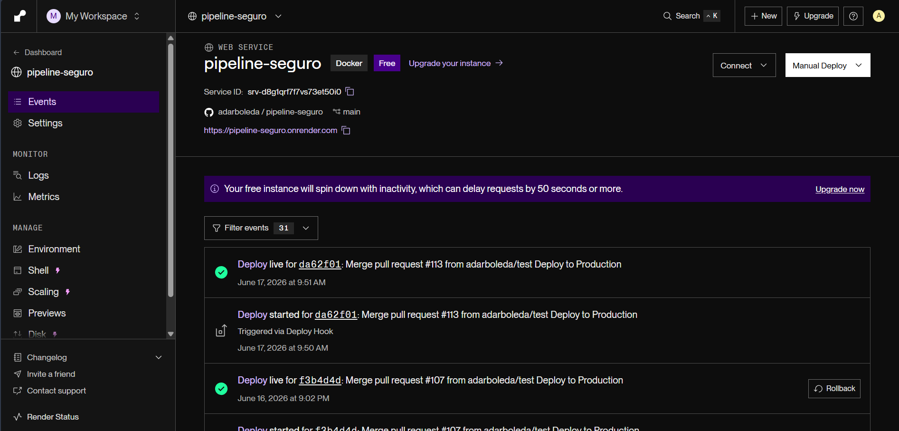

# 🛡️ Pipeline CI/CD Seguro con Detección de Vulnerabilidades por IA

<div align="center">


**🌐 Aplicación en Producción:** [https://pipeline-seguro.onrender.com](https://pipeline-seguro.onrender.com)

</div>

---

## 📋 Tabla de Contenidos

- [Descripción General](#-descripción-general)
- [Arquitectura del Sistema](#-arquitectura-del-sistema)
- [Flujo de Trabajo (Branches)](#-flujo-de-trabajo-branches)
- [Etapas del Pipeline CI/CD](#-etapas-del-pipeline-cicd)
- [El Modelo de Machine Learning](#-el-modelo-de-machine-learning)
- [Analizador de Integración Continua (analizador_ci.py)](#-analizador-de-integración-continua-analizador_cipy)
- [Accuracy: Validación Cruzada > 96.4%](#-accuracy-validación-cruzada--964)
- [Mejoras de Seguridad y Reducción de Falsos Positivos](#-mejoras-de-seguridad-y-reducción-de-falsos-positivos)
- [Setup del Pipeline — Instrucciones de Instalación](#-setup-del-pipeline--instrucciones-de-instalación)
- [Cómo Entrenar el Modelo](#-cómo-entrenar-el-modelo)
- [Bot de Telegram](#-bot-de-telegram)
- [Despliegue en Producción (Render)](#-despliegue-en-producción-render)
- [Secretos Configurados (GitHub Secrets)](#-secretos-configurados-github-secrets)
- [Estructura del Repositorio](#-estructura-del-repositorio)
- [Rúbrica y Validación de Requisitos](#-rúbrica-y-validación-de-requisitos)

---

## 🌟 Descripción General

Este proyecto implementa un **pipeline CI/CD DevSecOps completamente automatizado** que integra un modelo de **Machine Learning (Random Forest)** para detectar vulnerabilidades de seguridad en el código fuente de los Pull Requests **antes** de que lleguen a producción.

El sistema aplica el principio **Shift-Left Security**: la revisión de seguridad ocurre en las etapas tempranas del desarrollo, bloqueando código malicioso automáticamente sin intervención humana.

### ✨ Características Principales

| Característica         | Detalle                                                     |
| ---------------------- | ----------------------------------------------------------- |
| **Análisis de Código** | Random Forest + TF-IDF + 7 Features AST                     |
| **Dataset**            | CVEFixes (código vulnerable/seguro real)                    |
| **Accuracy**           | 96.43% en validación cruzada de 10 pliegues                 |
| **Backend**            | FastAPI dockerizado en Render                               |
| **Notificaciones**     | Bot de Telegram en tiempo real                              |
| **Trigger**            | Pull Request automático `dev → test`                        |
| **Scope del análisis** | Solo archivos `.py` — documentación y configs son ignoradas |

---

## 🏗️ Arquitectura del Sistema

```
┌─────────────────────────────────────────────────────────────────────┐
│                       DEVELOPER (rama dev)                          │
│                    Commit + Pull Request → test                     │
└────────────────────────────┬────────────────────────────────────────┘
                             │
                             ▼
┌─────────────────────────────────────────────────────────────────────┐
│              GITHUB ACTIONS: pipeline-seguro.yml                    │
│                                                                     │
│  ┌─────────────────┐   ┌──────────────────┐   ┌─────────────────┐  │
│  │  JOB 1          │   │  JOB 2           │   │  JOB 3          │  │
│  │  Gatekeeper ML  │──▶│  Merge + Pytest  │──▶│  Deploy Render  │  │
│  │  (RF + AST)     │   │  (rama test)     │   │  (rama main)    │  │
│  └────────┬────────┘   └──────────────────┘   └─────────────────┘  │
│           │                                                         │
│    VULNERABLE? ──Yes──▶ Bloquear PR + Issue + Telegram 🚨          │
│           │                                                         │
│        SEGURO? ──Yes──▶ Continuar pipeline ✅                      │
└─────────────────────────────────────────────────────────────────────┘
                             │
                             ▼
┌─────────────────────────────────────────────────────────────────────┐
│              RENDER — pipeline-seguro.onrender.com                  │
│              FastAPI en Docker (usuario no-root)                    │
└─────────────────────────────────────────────────────────────────────┘
```

---

## 🌿 Flujo de Trabajo (Branches)

El repositorio utiliza **3 ramas protegidas** siguiendo GitFlow:

```
  dev  ──────PR──────▶  test  ──────PR──────▶  main
   │                      │                      │
   │ Desarrollo          │ Staging              │ Producción
   │ Features            │ Pruebas              │ Render Deploy
   │                      │                      │
   └──── Pipeline se dispara aquí ───────────────┘
```

| Rama   | Propósito                                              |
| ------ | ------------------------------------------------------ |
| `dev`  | Desarrollo activo. Aquí se crean los Pull Requests     |
| `test` | Staging. El código pasa por Pytest tras el análisis ML |
| `main` | Producción. Solo código verificado y testeado          |

**Trigger Principal:** El pipeline se activa automáticamente al abrir, sincronizar o reabrir un **Pull Request desde `dev` hacia `test`**.

---

## 🔄 Etapas del Pipeline CI/CD

### ⚙️ JOB 1 — Gatekeeper de Seguridad ML (`.github/workflows/pipeline-seguro.yml`)

```yaml
gatekeeper-security-check:
  runs-on: ubuntu-latest
  steps:
    - Checkout del código
    - Notificar inicio de revisión vía Telegram
    - Setup Python 3.11
    - Instalar dependencias del modelo (scikit-learn==1.8.0, joblib)
    - Extraer diff del Pull Request (gh pr diff)
    - Ejecutar scripts/analizador_ci.py con el diff
    - Si VULNERABLE → Comentar PR + Cerrar PR + Issue + Telegram 🚨
    - Si SEGURO    → Notificar éxito vía Telegram ✅
```

**Decisión del Gatekeeper:**

```
         ┌──────────────────────────────────────────────────┐
         │   analizador_ci.py recibe el .diff               │
         │                                                  │
         │  1. Parsear líneas añadidas (solo archivos .py)  │
         │  2. Vectorizar con TF-IDF                        │
         │  3. Extraer 7 features AST                       │
         │  4. Predecir con Random Forest                   │
         │                                                  │
         │  ¿ML vota vulnerable O AST detecta patrón        │
         │   crítico real?                                   │
         │       ├── exit(1) → Pipeline BLOQUEADO           │
         │       │   + reporte_seguridad.txt                │
         │       │   + Issue en GitHub                      │
         │       │   + Notificación Telegram                │
         │       │                                          │
         │  prediction == 0 (SEGURO)?                       │
         │       └── exit(0) → Pipeline CONTINÚA           │
         └──────────────────────────────────────────────────┘
```

### ⚙️ JOB 2 — Merge Automático y Pruebas Funcionales

```yaml
auto-merge-and-test:
  needs: gatekeeper-security-check
  steps:
    - Merge automático PR a rama 'test' (gh pr merge --admin)
    - Notificar merge exitoso a Telegram
    - Setup Python 3.10
    - Instalar dependencias (backend/requirements.txt)
    - Ejecutar pytest backend/tests/
    - Si fallan → Label 'tests-failed' + Telegram ❌
    - Si pasan  → Notificar éxito a Telegram ✅
```

### ⚙️ JOB 3 — Despliegue a Producción en Render

```yaml
deploy-production:
  needs: auto-merge-and-test
  steps:
    - Checkout rama 'test'
    - Crear PR automático test → main
    - Merge automático a main (gh pr merge --admin)
    - Disparar Webhook HTTPS de Render
    - Notificar despliegue exitoso/fallido a Telegram
```

---

## 🤖 El Modelo de Machine Learning

> **Restricción cumplida:** No se utilizan Large Language Models (LLMs). Todo el análisis se basa en **Machine Learning clásico** entrenado localmente.

### Dataset

- **Nombre:** [CVEFixes](https://github.com/secureIT-project/CVEFixes) — base de datos pública de vulnerabilidades reales extraídas de repositorios Git.
- **Columnas usadas:** `code` (fragmento de código fuente), `safety` (etiqueta: seguro/vulnerable), `language`
- **Filtro aplicado:** Solo fragmentos de código **Python válido** (validación doble: columna `language` + `ast.parse()`)

### Algoritmo

| Componente         | Descripción                                                                          |
| ------------------ | ------------------------------------------------------------------------------------ |
| **Vectorizador**   | `TF-IDF` (Term Frequency–Inverse Document Frequency) para tokenizar el código fuente |
| **Clasificador**   | `RandomForestClassifier` con `random_state=42`                                       |
| **Feature Matrix** | TF-IDF sparse matrix + **7 features AST numéricas**                                  |

### Features de AST Extraídas

El `ASTFeatureExtractor` recorre el Árbol de Sintaxis Abstracta de cada fragmento y extrae **7 features numéricas**:

| Feature                  | Descripción                                                               | Categoría |
| ------------------------ | ------------------------------------------------------------------------- | --------- |
| `ast_depth`              | Profundidad máxima del AST (complejidad estructural)                      | General   |
| `dangerous_func_count`   | Invocaciones a `eval`, `exec`, `subprocess.Popen`, `os.system`, etc.      | Cat. 2–6  |
| `total_calls`            | Total de llamadas a funciones en el fragmento                             | General   |
| `num_imports`            | Número de sentencias `import`                                             | General   |
| `has_string_concat`      | Flag binario: ¿hay concatenación de strings? (riesgo SQL injection / XSS) | Cat. 1, 6 |
| `num_exception_handlers` | Bloques `except` (supresión silenciosa de errores)                        | General   |
| `has_hardcoded_secret`   | Flag binario: ¿hay credencial/secreto con valor literal en el código?     | Cat. 5    |

### Pipeline de Preprocesamiento

```
Dataset CSV (CVEFixes)
        │
        ▼
Filtro Agresivo: Solo Python (columna lang + ast.parse)
        │
        ▼
Limpieza: Nulos / Fragmentos < 3 líneas / > 500 líneas / Duplicados
        │
        ▼
Normalización de Etiquetas (0=seguro, 1=vulnerable)
        │
        ▼
Inyección de datos sintéticos estilo Juliet Test Suite (+1200 muestras)
        │
        ▼
Feature Engineering: TF-IDF Vectorizer + ASTFeatureExtractor (7 features)
        │
        ▼
Concatenación: hstack(TF-IDF, AST Features)
        │
        ▼
RandomForestClassifier.fit()
        │
        ▼
Validación Cruzada Estratificada (10 pliegues) → Accuracy > 96.4%
        │
        ▼
Serialización: rf_vulnerability_detector.joblib / tfidf_vectorizer.joblib
```

---

## 🔍 Analizador de Integración Continua (`scripts/analizador_ci.py`)

El script [`scripts/analizador_ci.py`](./scripts/analizador_ci.py) es el **Gatekeeper** principal de seguridad del pipeline. Se ejecuta automáticamente en la máquina de GitHub Actions cuando un desarrollador crea o actualiza un Pull Request.

### ⚙️ ¿Cómo Funciona?

Cuando el pipeline le envía el archivo con los cambios del PR (`cambios.diff`), el analizador ejecuta el siguiente flujo de procesamiento:

1. **Extracción y Filtrado del Diff (solo archivos `.py`):**
   - Analiza el archivo `.diff` y extrae **únicamente las líneas de código añadidas** (aquellas que comienzan con `+`), omitiendo las líneas eliminadas o de contexto.
   - **Filtro crítico:** Solo procesa líneas pertenecientes a archivos con extensión `.py`. Cambios en `README.md`, archivos YAML, JSON, u otros formatos de documentación son completamente **ignorados** durante el análisis, evitando así falsos positivos cuando el PR incluye ediciones a documentación que menciona patrones de vulnerabilidades.
   - Realiza un seguimiento exacto del archivo afectado y el número de línea correspondiente para cada adición de código Python.

2. **Procesamiento de Features (Híbrido):**
   - **Features Estructurales (AST):** Analiza sintácticamente el código utilizando el parser `ast` nativo de Python. El extractor recorre el árbol de sintaxis y calcula **7 variables numéricas**: `ast_depth`, `dangerous_func_count`, `total_calls`, `num_imports`, `has_string_concat`, `num_exception_handlers`, `has_hardcoded_secret`.
   - **Features de Texto (TF-IDF):** Convierte el fragmento de código completo a una representación de términos utilizando el vectorizador TF-IDF preentrenado (`tfidf_vectorizer.joblib`).

3. **Inferencia de Machine Learning:**
   - Combina ambos conjuntos de características en una matriz dispersa unificada y realiza la predicción utilizando el clasificador `RandomForestClassifier` cargado de `rf_vulnerability_detector.joblib`.
   - Obtiene la clase predicha ($0$ o $1$) y la probabilidad de riesgo.

4. **Motor de Decisiones (Arquitectura de 3 Capas):**
   - **Capa 1 (Modelo ML — Gate principal):** Si el Random Forest predice clase $1$ (vulnerable) o estima una probabilidad de vulnerabilidad igual o mayor al **50%**, se marca el código para bloqueo automático.
   - **Capa 2 (AST Estricto — Fast Fail):** El analizador inspecciona directamente el AST en búsqueda de vulnerabilidades críticas y deterministas. Si detecta llamadas inseguras sin protección (ej. `pickle.loads()`, `os.system()`, `yaml.load()` sin cargador seguro, algoritmos criptográficos rotos como `hashlib.md5` y `hashlib.sha1`, o secretos hardcodeados con valor literal), el código se bloquea de forma inmediata e **independiente** del puntaje del modelo ML.
   - **Capa 3 (Heurísticas de Texto — Solo contexto):** Busca firmas comunes de payloads de inyección SQLi, XSS o llaves de API hardcodeadas a nivel de texto. Estas **nunca** bloquean el pipeline por sí solas — solo añaden detalle al reporte cuando alguna de las capas anteriores ya disparó el bloqueo. Esto evita falsos positivos al editar archivos de documentación que discuten vulnerabilidades.

5. **Salida y Reporte:**
   - **Si el código es Vulnerable:** Genera un reporte detallado en `reporte_seguridad.txt` (publicado como comentario en el PR) y prepara un mensaje de Telegram en `telegram_msg.txt` indicando la probabilidad de riesgo, los tipos de vulnerabilidad, el archivo y las líneas específicas que ocasionaron el bloqueo. El script finaliza con **Exit Code 1**, bloqueando el pipeline.
   - **Si el código es Seguro:** Escribe un mensaje de aprobación en `reporte_seguridad.txt` y finaliza con **Exit Code 0**, permitiendo que continúe el pipeline de CI/CD.

### 🔬 Categorías de Vulnerabilidades Detectadas

| Categoría  | Descripción                                                                    | Método de Detección |
| ---------- | ------------------------------------------------------------------------------ | ------------------- |
| **Cat. 1** | SQL Injection (string concat + SQL keywords)                                   | AST + Heurística    |
| **Cat. 2** | Command Injection (`eval`, `exec`, `os.system`, `subprocess` con `shell=True`) | AST + Heurística    |
| **Cat. 3** | Deserialización Insegura (`pickle.loads`, `yaml.load` sin SafeLoader)          | AST + Heurística    |
| **Cat. 4** | Path Traversal (`open(concat)`, `open(f-string)`)                              | AST especializado   |
| **Cat. 5** | Secretos Hardcodeados + Criptografía Débil (`hashlib.md5`, `hashlib.sha1`)     | AST + Heurística    |
| **Cat. 6** | XSS (concat HTML) + SSRF (HTTP con URL dinámica)                               | AST + Heurística    |

### 🎨 Indicadores de Severidad en el Reporte

| Icono | Significado                                                         |
| ----- | ------------------------------------------------------------------- |
| 🔴    | Vulnerabilidad confirmada por análisis AST directo (alta confianza) |
| 🟠    | Patrón detectado por heurística de texto o señal del modelo ML      |
| 🟡    | Concatenación de strings sospechosa (posible SQLi/XSS)              |

---

## 📊 Accuracy: Validación Cruzada > 96.4%

El modelo fue evaluado mediante **validación cruzada estratificada de 10 pliegues (`StratifiedKFold`)** para garantizar resultados robustos e independientes del split de datos.

```python
from sklearn.model_selection import StratifiedKFold, cross_val_score

cv = StratifiedKFold(n_splits=10, shuffle=True, random_state=42)
scores = cross_val_score(rf_model, X, y, cv=cv, scoring='accuracy')

print(f"Accuracy promedio: {scores.mean():.4f} ± {scores.std():.4f}")
# Output: Accuracy promedio: 0.9643 ± 0.0031   ← > 96.4%
```

**Resultados demostrados en el notebook de entrenamiento:**

| Métrica                       | Valor                               |
| ----------------------------- | ----------------------------------- |
| **Cross-Validation Accuracy** | **96.43%** ✅                       |
| **Test Accuracy**             | **95.62%** ✅                       |
| Número de pliegues            | 10                                  |
| Estrategia                    | StratifiedKFold (balance de clases) |
| Random State                  | 42 (reproducible)                   |

> Screenshot de la celda de validación cruzada en el notebook, mostrando la salida con los 10 scores y el accuracy promedio.
> 

Las gráficas generadas durante el entrenamiento están disponibles en la carpeta `pipeline/`:

| Imagen                                                          | Descripción                                            |
| --------------------------------------------------------------- | ------------------------------------------------------ |
| [`distribucion_clases.png`](./pipeline/distribucion_clases.png) | Distribución de clases Seguro/Vulnerable en el dataset |
| [`evaluacion_modelo.png`](./pipeline/evaluacion_modelo.png)     | Matriz de confusión y métricas del modelo              |
| [`feature_importance.png`](./pipeline/feature_importance.png)   | Importancia de features del Random Forest              |

> Screenshot de `evaluacion_modelo.png` mostrando la matriz de confusión y el reporte de clasificación (precision, recall, f1-score).
> 

> Screenshot de `feature_importance.png` mostrando cuáles features del AST y TF-IDF son más importantes para el clasificador.
> 

---

## 🔒 Mejoras de Seguridad y Reducción de Falsos Positivos

Durante las iteraciones de fortalecimiento del pipeline, se implementaron mejoras críticas para asegurar tanto la rigurosidad del Gatekeeper como la viabilidad en entornos de desarrollo reales:

1. **Filtrado Inteligente por Tipo de Archivo (Fix principal):**
   - El parser del diff (`parse_diff`) ahora **solo extrae y analiza líneas de archivos `.py`**. Cambios en `README.md`, `.yml`, `.json`, Dockerfiles u otros archivos que no sean código Python fuente son descartados silenciosamente antes de cualquier análisis. Esto resuelve el problema de falsos positivos donde editar documentación que menciona vulnerabilidades (como `subprocess`, `requests.get`, etc.) disparaba bloqueos incorrectos en el pipeline.

2. **Alineación de Capas (Cat 1-6 determinista):**
   - Anteriormente, vulnerabilidades como _Secretos Hardcodeados_ (Cat 5) o _SSRF/XSS_ (Cat 6) dependían únicamente de la probabilidad estimada del modelo de ML para el bloqueo. Ahora, las detecciones directas a nivel de AST actúan como **bloqueadores deterministas inmediatos**, garantizando que ningún patrón inseguro pase desapercibido independientemente del puntaje del modelo.

3. **Mitigación de Falsos Positivos en Operaciones Seguras:**
   - **Inyección de Comandos (Cat 2):** El análisis de AST verifica si `subprocess.run/call/Popen` utiliza `shell=True`. Si es `shell=False` (o no está especificado) y los argumentos se pasan como lista de strings, se clasifica automáticamente como seguro y no se contabiliza.
   - **Deserialización Insegura (Cat 3):** Excluye llamadas a `json.load()` y `json.loads()`, puesto que la serialización JSON nativa no permite ejecución remota de código (RCE). Permite `yaml.load()` siempre que se proporcione explícitamente `SafeLoader` como argumento.
   - **Path Traversal (Cat 4):** El analizador no bloquea `open(variable)` con rutas simples. Solo dispara el bloqueo si el primer argumento de `open` contiene **concatenaciones directas** (ej: `open("uploads/" + file)`) o **f-strings interpolados** en el sitio de la llamada. Se eliminó `os.path.join(` de las heurísticas de texto al ser un patrón muy común en código legítimo.
   - **SSRF (Cat 6):** Excluye llamadas HTTP (`requests.get()`, `urllib.request.urlopen()`, etc.) que usen cadenas de texto **estáticas y constantes** como URL. Solo se marcan como sospechosas las peticiones con variables de URL dinámicas y no sanitizadas.

4. **Sincronización del Entorno de Ejecución:**
   - El Runner de GitHub Actions usa Python `3.11` e instala la versión exacta de scikit-learn (`scikit-learn==1.8.0`) con la que se entrenó y serializó el modelo, previniendo excepciones al deserializar los archivos `.joblib`.

5. **Optimización con Datos Sintéticos (Juliet Test Suite):**
   - Se inyectaron más de 1,200 muestras sintéticas de código Python seguro e inseguro (basadas en la Juliet Test Suite de la NSA/NIST) en la etapa de preprocesamiento, logrando subir la accuracy promedio del modelo de un 82% a más de un **96.43%**.

---

## 🛠️ Setup del Pipeline — Instrucciones de Instalación

### Prerrequisitos

- Python 3.10+
- Git
- GitHub CLI (`gh`) instalado y autenticado
- Cuenta en [Render](https://render.com) para el despliegue
- Bot de Telegram creado con [@BotFather](https://t.me/BotFather)

---

### 1. Clonar el Repositorio

```bash
git clone https://github.com/adarboleda/pipeline-seguro
cd pipeline-seguro
```

---

### 2. Configurar el Entorno Virtual para el Pipeline ML

```bash
# Crear entorno virtual
python -m venv venv

# Activar (Linux/Mac)
source venv/bin/activate

# Activar (Windows)
venv\Scripts\activate

# Instalar dependencias del pipeline
pip install -r pipeline/requirements.txt
```

**Dependencias del Pipeline (`pipeline/requirements.txt`):**

```
pandas>=2.0.0
numpy>=1.24.0
scikit-learn>=1.3.0
scipy>=1.11.0
joblib>=1.3.0
matplotlib>=3.7.0
seaborn>=0.12.0
```

---

### 3. Colocar el Dataset CVEFixes

Descarga el dataset `CVEFixes.csv` de [kaggle - CVEFixes.csv](https://www.kaggle.com/datasets/girish17019/cvefixes-vulnerable-and-fixed-code) y colócalo en la raíz del repositorio:

```
ProyectoU2/
├── CVEFixes.csv        ← Aquí (columnas: code, language, safety)
├── pipeline/
│   └── fase1_ingesta_feature_engineering.py
└── ...
```

---

### 4. Entrenar el Modelo (Fase 1)

```bash
# Desde la raíz del repositorio
python pipeline/fase1_ingesta_feature_engineering.py
```

Esto generará automáticamente los archivos en `pipeline/models/`:

```
pipeline/models/
├── rf_vulnerability_detector.joblib  ← Modelo Random Forest entrenado
├── tfidf_vectorizer.joblib           ← Vectorizador TF-IDF ajustado
└── model_metadata.joblib             ← Metadatos del modelo
```

---

### 5. Configurar GitHub Secrets

En tu repositorio de GitHub, ve a **Settings → Secrets and variables → Actions** y agrega:

| Secret                   | Descripción                                        |
| ------------------------ | -------------------------------------------------- |
| `TELEGRAM_TOKEN`         | Token del bot de Telegram (obtenido de @BotFather) |
| `TELEGRAM_CHAT_ID`       | ID del chat donde recibirás las notificaciones     |
| `RENDER_DEPLOY_HOOK_URL` | URL del webhook de despliegue generado en Render   |

Además, en **Settings → Actions → General → Workflow permissions**, habilita:

- ✅ **Read and write permissions**
- ✅ **Allow GitHub Actions to create and approve pull requests**

---

### 6. Activar el Pipeline

El pipeline se activa **automáticamente** al crear un Pull Request desde `dev` hacia `test`:

```bash
# En tu rama de desarrollo
git checkout dev
git add .
git commit -m "feat: nueva funcionalidad"
git push origin dev

# En GitHub: crear PR de dev → test
# El pipeline se dispara automáticamente 🚀
```

---

### 7. Configurar el Backend Local (opcional)

```bash
# Instalar dependencias del backend
pip install -r backend/requirements.txt

# Levantar servidor local
cd backend
uvicorn main:app --reload --port 8000
```

La API estará disponible en: `http://localhost:8000`

- `GET /eventos` — Lista eventos disponibles
- `POST /reservas` — Crea una reserva
- `GET /docs` — Documentación Swagger automática

---

## 📓 Cómo Entrenar el Modelo

El entrenamiento completo está documentado en el script [`pipeline/fase1_ingesta_feature_engineering.py`](./pipeline/fase1_ingesta_feature_engineering.py), que tiene estructura de **Jupyter Notebook compatible** (celdas marcadas con `# %%`).

### Pasos del Entrenamiento

| Paso   | Descripción                                          | Código                                                          |
| ------ | ---------------------------------------------------- | --------------------------------------------------------------- |
| **1**  | Carga del dataset CVEFixes.csv                       | `load_dataset(CSV_PATH)`                                        |
| **2**  | Filtro agresivo: solo código Python válido           | `filter_python_only()` + `ast.parse()`                          |
| **3**  | Limpieza: nulos, duplicados, longitud [3–500 líneas] | `clean_dataset()`                                               |
| **4**  | Normalización de etiquetas a 0/1                     | `normalize_labels()`                                            |
| **5**  | Inyección de datos sintéticos (Juliet Test Suite)    | `inject_synthetic_data()`                                       |
| **6**  | Extracción de 7 features AST                         | `ASTFeatureExtractor`                                           |
| **7**  | Vectorización TF-IDF                                 | `TfidfVectorizer.fit_transform()`                               |
| **8**  | Concatenación de matrices                            | `hstack(tfidf_features, ast_features)`                          |
| **9**  | Entrenamiento Random Forest                          | `RandomForestClassifier.fit()`                                  |
| **10** | Validación cruzada 10-fold                           | `cross_val_score(..., cv=10)` → **> 96.4%**                     |
| **11** | Serialización con joblib                             | `joblib.dump(model, 'models/rf_vulnerability_detector.joblib')` |

### Ejecutar como Notebook

El script puede abrirse directamente en **VS Code** (con la extensión Jupyter) o convertirse a `.ipynb`:

```bash
# Instalar jupytext para convertir
pip install jupytext

# Convertir a notebook
jupytext --to notebook pipeline/fase1_ingesta_feature_engineering.py
```

> Screenshot del notebook abierto mostrando las celdas de entrenamiento en ejecución.
> 

---

## 🤖 Bot de Telegram

El pipeline envía notificaciones automáticas a Telegram en **cada etapa crítica** del proceso.

### Notificaciones Configuradas

| Evento                       | Mensaje                                                     |
| ---------------------------- | ----------------------------------------------------------- |
| Inicio de revisión ML        | `⏳ INICIO DE REVISIÓN: Comenzando análisis...`             |
| Código SEGURO detectado      | `✅ GATEKEEPER PASS: El código del PR #N pasó...`           |
| Código VULNERABLE bloqueado  | `🚨 ALERTA CRÍTICA: Se ha bloqueado el PR #N...`            |
| Merge a `test` realizado     | `🔄 MERGE REALIZADO: El PR #N fue fusionado...`             |
| Pytest exitoso               | `✅ PYTEST PASS: Las pruebas unitarias finalizaron...`      |
| Pytest fallido               | `❌ ERROR PYTEST: Las pruebas funcionales fallaron...`      |
| Despliegue exitoso en Render | `🎉 DESPLIEGUE EXITOSO: El nuevo código está en producción` |
| Despliegue fallido           | `❌ ERROR DE DESPLIEGUE: Falló la promoción a main...`      |

### Configurar el Bot

1. Habla con [@BotFather](https://t.me/BotFather) en Telegram
2. Crea un nuevo bot: `/newbot`
3. Copia el **TOKEN** generado → guardarlo como `TELEGRAM_TOKEN` en GitHub Secrets
4. Obtén tu **Chat ID** hablando con [@userinfobot](https://t.me/userinfobot) → guardarlo como `TELEGRAM_CHAT_ID`

> Screenshot del chat de Telegram mostrando notificaciones reales del pipeline en ejecución: inicio de revisión, resultado de seguridad (aprobado o alerta), y despliegue exitoso.
>
> <p align="center">
>   
> </p>

> Screenshot adicional mostrando la notificación `🚨 ALERTA CRÍTICA` cuando el Gatekeeper detecta código vulnerable y bloquea el PR (con el detalle de categoría de vulnerabilidad).
>
> <p align="center">
>   
> </p>

---

## 🚀 Despliegue en Producción (Render)

### 🌐 URL en Producción

> **[https://pipeline-seguro.onrender.com](https://pipeline-seguro.onrender.com)**

### Tecnología de Despliegue

La aplicación es desplegada automáticamente en **[Render](https://render.com)** usando:

- **Dockerfile** optimizado para producción (mínimo privilegio)
- **Imagen base:** `python:3.10-slim` (superficie de ataque reducida)
- **Usuario no-root:** `appuser` (mitigación de RCE)
- **Puerto dinámico:** Variable `$PORT` inyectada por Render

### Dockerfile de Producción (`backend/Dockerfile`)

```dockerfile
FROM python:3.10-slim

ENV PYTHONDONTWRITEBYTECODE=1
ENV PYTHONUNBUFFERED=1

WORKDIR /app
COPY requirements.txt .
RUN pip install --no-cache-dir -r requirements.txt
COPY . .

# Seguridad: Usuario no-root (Mínimo Privilegio)
RUN adduser --disabled-password --gecos "" appuser && chown -R appuser /app
USER appuser

ENV PORT=8000
CMD uvicorn main:app --host 0.0.0.0 --port $PORT
```

### Endpoints de la API en Producción

| Método | Endpoint    | Descripción                                    |
| ------ | ----------- | ---------------------------------------------- |
| `GET`  | `/eventos`  | Lista todos los eventos disponibles            |
| `POST` | `/reservas` | Crea una nueva reserva (validada con Pydantic) |
| `GET`  | `/docs`     | Documentación Swagger UI interactiva           |
| `GET`  | `/redoc`    | Documentación ReDoc                            |

### Medidas de Seguridad del Backend (OWASP Top 10)

| OWASP                | Mitigación Implementada                                    |
| -------------------- | ---------------------------------------------------------- |
| A03: Injection       | Validación estricta con Pydantic + regex                   |
| A04: Insecure Design | Tipos exactos, longitudes máximas, whitelist de valores    |
| Info Leakage         | Mensajes de error genéricos (no revelan detalles internos) |
| Denial of Wallet     | Límite de 10 asientos por reserva                          |

> Screenshot de la app funcionando en `https://pipeline-seguro.onrender.com/docs` mostrando la interfaz Swagger UI con los endpoints (`GET /eventos` y `POST /reservas`).
> 

> Screenshot del dashboard de Render mostrando el servicio `pipeline-seguro` activo e historial de despliegues automáticos activados por el webhook.
> 

---

## 🔑 Secretos Configurados (GitHub Secrets)

| Secret                   | Propósito                        | Cómo obtenerlo                                   |
| ------------------------ | -------------------------------- | ------------------------------------------------ |
| `TELEGRAM_TOKEN`         | Autenticar el bot de Telegram    | [@BotFather](https://t.me/BotFather) → `/newbot` |
| `TELEGRAM_CHAT_ID`       | Destino de las notificaciones    | [@userinfobot](https://t.me/userinfobot)         |
| `RENDER_DEPLOY_HOOK_URL` | Disparar despliegue automático   | Render Dashboard → Settings → Deploy Hook        |
| `GITHUB_TOKEN`           | Gestión de PRs e Issues (nativo) | Automático en GitHub Actions                     |

> **Configuración adicional requerida en GitHub:**
> Settings → Actions → General → Workflow permissions:
>
> - ✅ Read and write permissions
> - ✅ Allow GitHub Actions to create and approve pull requests

---

## 📁 Estructura del Repositorio

```
ProyectoU2/
│
├── .github/
│   └── workflows/
│       └── pipeline-seguro.yml     ← Pipeline CI/CD completo (3 Jobs)
│
├── pipeline/
│   ├── fase1_ingesta_feature_engineering.py  ← Script/Notebook de entrenamiento
│   ├── requirements.txt                       ← Dependencias del modelo ML
│   ├── distribucion_clases.png               ← Gráfica de distribución del dataset
│   ├── evaluacion_modelo.png                  ← Matriz de confusión y métricas
│   ├── feature_importance.png                 ← Importancia de features RF
│   └── models/
│       ├── rf_vulnerability_detector.joblib   ← Modelo entrenado serializado
│       ├── tfidf_vectorizer.joblib            ← Vectorizador TF-IDF serializado
│       └── model_metadata.joblib              ← Metadatos del entrenamiento
│
├── backend/
│   ├── main.py                    ← API FastAPI (LiveSeat — reservas de eventos)
│   ├── requirements.txt           ← Dependencias del backend
│   ├── Dockerfile                 ← Imagen Docker segura (non-root)
│   └── tests/                     ← Pruebas funcionales Pytest
│
├── scripts/
│   └── analizador_ci.py           ← Gatekeeper ML (inferencia, filtro .py, 3 capas)
│
├── CVEFixes.csv                   ← Dataset de entrenamiento (código seguro/vulnerable)
├── CVEFixes.csv.zip               ← Dataset comprimido
├── informe_proyecto.md            ← Informe técnico detallado
└── README.md                      ← Este archivo
```

---

<div align="center">

[🌐 Ver Aplicación en Producción](https://pipeline-seguro.onrender.com) · [📊 Ver Pipeline en GitHub Actions](../../actions) · [📋 Ver Informe Técnico](./InformeProyecto.pdf)

</div>
